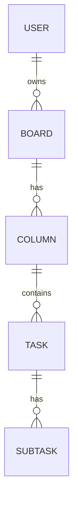

# TaskFlow

A full-stack Kanban task manager. FastAPI on the back, React on the front, one database in between.

TaskFlow is a complete implementation of the Frontend Mentor *Kanban task management* challenge, built as a real full-stack application rather than a static front end. Boards hold columns, columns hold tasks, tasks hold subtasks, and every change is persisted through a typed REST API.

---

## Stack

| Layer | Technology |
| --- | --- |
| API | FastAPI, Pydantic v2 |
| Persistence | SQLAlchemy 2.0, SQLite, Alembic migrations |
| Frontend | React, TypeScript, Vite, Tailwind CSS v4 |
| Tooling | uv (Python), pnpm (Node), pytest |

---

## Architecture

The repository is a monorepo with two independent applications, a Python backend and a Node frontend, each self-contained.

```
taskflow-api/
├── backend/
│   ├── app/
│   │   ├── main.py            # entry point: app, routers, CORS
│   │   ├── database.py        # engine, session, Base
│   │   ├── users/             # ┐
│   │   ├── boards/            # ├ one package per domain:
│   │   └── tasks/             # ┘ models · schemas · router · service
│   ├── alembic/               # versioned schema migrations
│   ├── tests/                 # pytest suite, isolated test database
│   └── pyproject.toml
└── frontend/
    ├── src/
    └── package.json
```

The backend is organized **by domain, not by layer**. Instead of one folder for all models and another for all routes, each feature (`users`, `boards`, `tasks`) is a self-contained package that holds its own models, schemas, routes, and business logic. Routes stay thin and delegate to a service layer.

---

## Data model



A task's status is not a separate field, it is simply the column the task belongs to. Moving a task between columns and reordering it within one are driven by a `position` index, so the board always renders in a stable, intentional order.

---

## API

Interactive documentation lives at `/docs` once the backend is running.

| Method | Endpoint | Description |
| --- | --- | --- |
| POST | `/users` | Create a user |
| GET | `/users` | List users |
| GET | `/boards` | List boards |
| POST | `/boards` | Create a board with its columns |
| GET | `/boards/{id}` | Full board: columns, tasks, and subtasks |
| PUT | `/boards/{id}` | Rename a board and sync its columns |
| DELETE | `/boards/{id}` | Delete a board and everything under it |
| POST | `/tasks` | Create a task with its subtasks |
| PUT | `/tasks/{id}` | Edit a task |
| PATCH | `/tasks/{id}` | Move a task to another column |
| DELETE | `/tasks/{id}` | Delete a task |
| PATCH | `/subtasks/{id}` | Mark a subtask complete or incomplete |

---

## Running locally

**Backend** — requires [uv](https://docs.astral.sh/uv/):

```bash
cd backend
uv sync
uv run alembic upgrade head
uv run uvicorn app.main:app --reload
```

The API starts on `http://localhost:8000`.

**Frontend** — requires Node and pnpm:

```bash
cd frontend
pnpm install
pnpm dev
```

The app starts on `http://localhost:5173`.

---

## Testing

```bash
cd backend
uv run pytest
```

The suite runs against an isolated in-memory database, so it never touches development data.

---

## Design notes

A few deliberate choices behind the code:

- **Domain-based modules.** Each feature is its own package, so the codebase grows outward instead of piling into ever-larger shared files.
- **Service layer.** Routes handle HTTP, services handle data and logic, and the two never bleed into each other.
- **Migrations over auto-create.** The schema is versioned with Alembic, so every change is reproducible and reversible.
- **Ordered relationships.** Columns and tasks come back sorted by position, which keeps the board predictable and makes drag-and-drop reordering straightforward.

---

## Status

The backend is feature-complete for the challenge's core scope: full CRUD for boards and tasks, nested reads, moving tasks between columns, toggling subtasks, and a tested, CORS-enabled API. The frontend foundation is in place, with the Kanban interface in progress. Authentication and drag-and-drop reordering are the next steps on the roadmap.